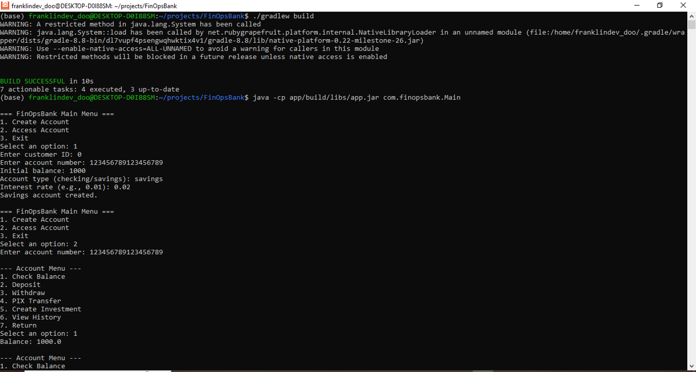
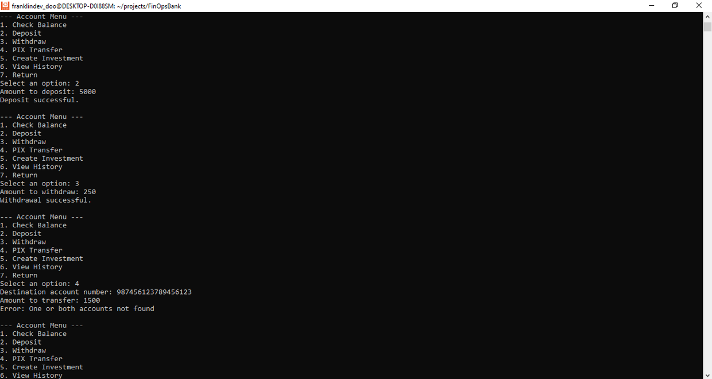
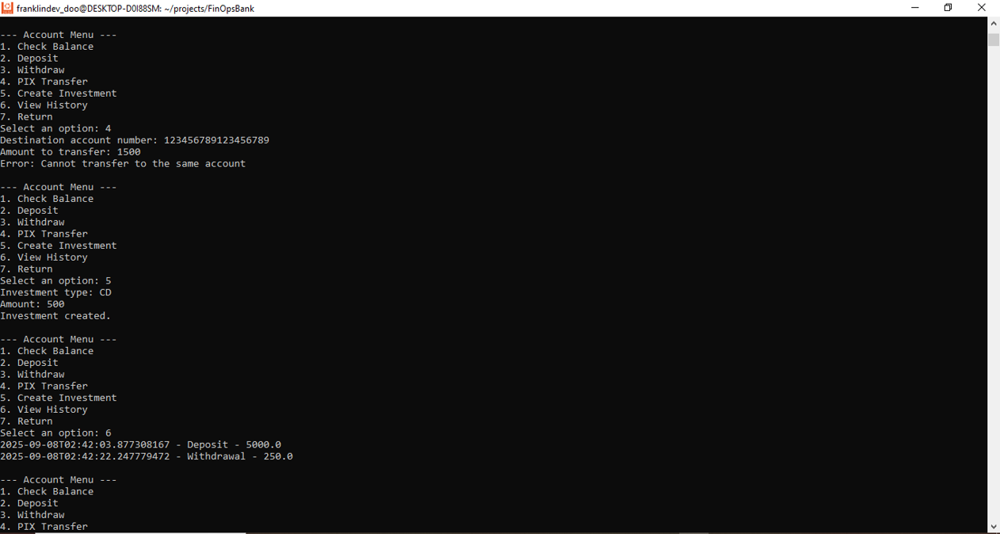
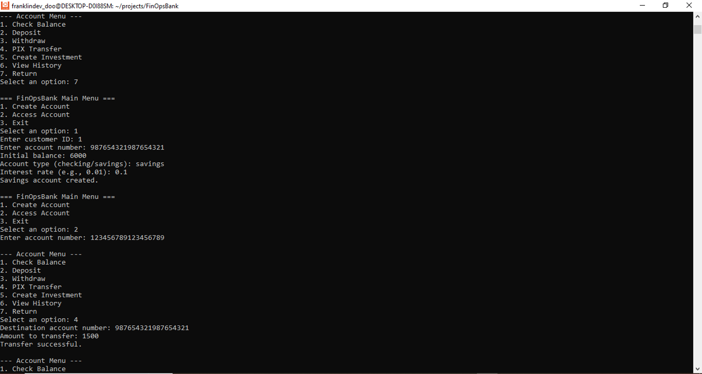
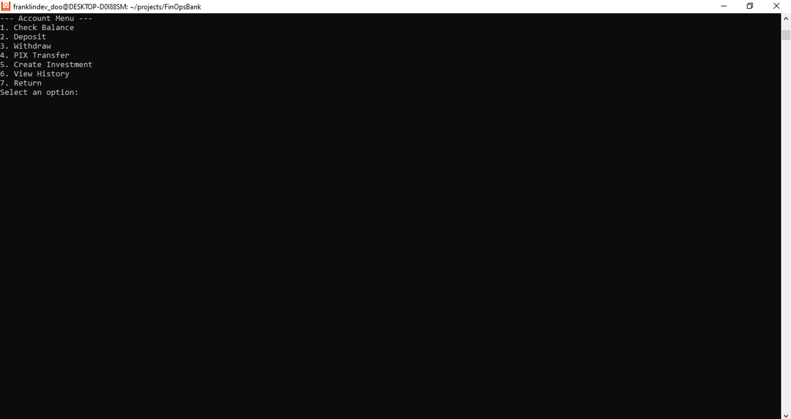

# Phase 4: Manual Testing & Results

## Overview
This document records the manual testing phase of the FinOpsBank application, including all steps taken, the results, and a screenshot of the successful console session. This phase demonstrates that all core features work as intended in a real user scenario.

---

## 1. Testing Steps

### 1. Create First Account
- Selected option 1 (Create Account)
- Entered customer ID: 0
- Entered account number: 123456789123456789
- Initial balance: 1000
- Account type: savings
- Interest rate: 0.02
- **Result:** Savings account created

### 2. Create Second Account
- Selected option 1 (Create Account)
- Entered customer ID: 1
- Entered account number: 987654321987654321
- Initial balance: 6000
- Account type: savings
- Interest rate: 0.1
- **Result:** Savings account created

### 3. Access First Account and Test Operations
- Selected option 2 (Access Account)
- Entered account number: 123456789123456789
- Checked balance: 1000.0
- Deposited: 5000
- Withdrew: 250
- Attempted transfer to non-existent account: error as expected
- Attempted transfer to same account: error as expected
- Created investment: type CD, amount 500
- Viewed transaction history: deposit and withdrawal shown

### 4. Test PIX Transfer
- Accessed first account again
- Selected PIX transfer
- Destination account: 987654321987654321
- Amount: 1500
- **Result:** Transfer successful

---

## 2. Results
- All core features (account creation, deposit, withdrawal, transfer, investment, transaction history) work as expected.
- Error handling for invalid transfers is correct.
- Console interface is user-friendly and robust.

---

## 3. Screenshots

Below are screenshots documenting the manual testing session:

1. **Account Creation and Main Menu**
	
2. **Deposits, Withdrawals, and Error Handling**
	
3. **PIX Transfer Attempt and Success**
	
4. **Investment Creation and Transaction History**
	
5. **Final Account States and Menu Navigation**
	

*Place your actual screenshot files in the docs directory with the above filenames to complete the documentation.*

---

## 4. Conclusion
The FinOpsBank application is fully functional and passes all manual tests. It is ready for further development, deployment, or demonstration.
